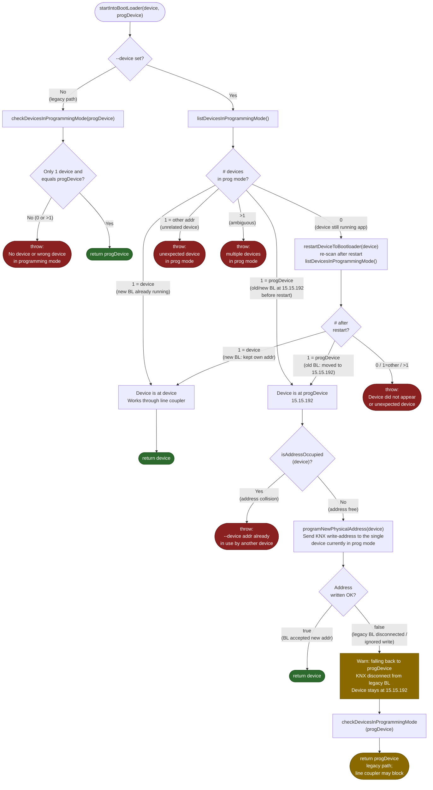

# Line Coupler Support

This document shows the flow of `DeviceManagement::startIntoBootLoader`, with
emphasis on which paths work transparently through KNX line couplers and which may fail.

## Background

**Old bootloader v1.20 (and older)** hardcodes its KNX physical address to `15.15.192` when entering bootloader mode.
Line couplers typically do **not** route to/from a device that lives on another line.
So the Updater may not reach the device at `15.15.192` and an update will fail.

**New bootloader** uses the same KNX physical address as the application address (`--device`).
This allows the Updater to reach the device through line couplers, even if the device is on a different line than the
Updater.

## Relevant CLI options

| Option                | Description                                                                 |
|-----------------------|-----------------------------------------------------------------------------|
| `--device <addr>`     | KNX address of the device while running the application.                    |
| `--progDevice <addr>` | KNX address the device uses in bootloader/prog mode (default: `15.15.192`). |

## Flowchart for `DeviceManagement::startIntoBootLoader`

## Key structural detail: after restart

After `restartDeviceToBootloader()` the code calls `listDevicesInProgrammingMode()` again and
**falls through the same if-conditions** as the "already in prog mode" paths.  This means:

- **Restart → new BL** (device at `device`) → fast return, no address programming needed.
- **Restart → old BL** (device at `progDevice`) → goes through the **full** address-conflict check
  and `programNewPhysicalAddress` attempt, just like when the device was already in prog mode before
  the updater started. This ensures the address is always corrected if possible.

## Scenario summary

| # | `--device` | `--progDevice` | # Devices initially in prog mode | Running          | Result                                                                  | Line coupler safe? |
|---|------------|----------------|----------------------------------|------------------|-------------------------------------------------------------------------|--------------------|
| 1 | not set    | set            | 1 = progDevice                   | old or new BL    | return progDevice                                                       | no                 |
| 2 | set        | default        | 0                                | app + **new BL** | restart → keeps device address → return device                          | yes                |
| 3 | set        | default        | 0                                | app + **new BL** | restart → falls back to progDevice address → PA program → return device | yes                |
| 4 | set        | default        | 0                                | app + **old BL** | restart → gets progDevice address → PA rejected → fallback progDevice   | no                 |
| 5 | set        | default        | 1 = device                       | **new BL**       | return device                                                           | yes                |
| 6 | set        | 15.15.192      | 1 = progDevice                   | **new BL**       | PA program → return device                                              | yes                |
| 7 | set        | 15.15.192      | 1 = progDevice                   | **old BL**       | PA rejected → fallback progDevice                                       | no                 |
| 8 | set        | any            | 1 = other                        | -                | throw: unexpected device in prog mode                                   | -                  |
| 9 | set        | any            | >1                               | -                | throw: multiple devices in prog mode                                    | -                  |

## Line coupler compatibility behavior

- **New bootloader with application**   
  Device has the same address after a restart into bootloader → Should work through line couplers.
- **New bootloader without application**  
  Updater attempts `programNewPhysicalAddress` with value of `--device`.
  If successfully, device should have a line coupler compatible address.
- **Old bootloader**  
  Updater will fail `programNewPhysicalAddress` with KNX disconnect, because the old bootloader doesn't support it.
  Updater falls back to `--progDevice` (default 15.15.192). → 
  **No line coupler support** unless the line couplers filters are disabled.

## Disclaimer
Parts of this document and flowchart contain information generated by AI.
